<div align="center">

# ⚓ Cargo Storm

**Connect 4, re-imagined in a ship's hold, where gravity shifts and everything slides.**<br>
A hand-built game, plus three reinforcement-learning agents (DQN, PPO and SAC) trained from scratch to play it, and a 28,000-game tournament to find out which one learned best.


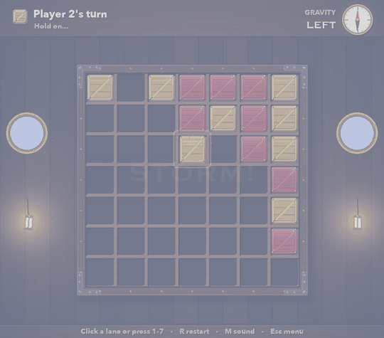

*A storm hits: lightning, the compass picks a new gravity, the hold rolls, and every crate slides.*

</div>

---

## Contents

- [The game](#-the-game)
- [How to play](#-how-to-play)
- [Quick start](#-quick-start)
- [How it's built](#-how-its-built)
- [The AI](#-the-ai)
- [Results: the tournament](#-results-the-tournament)
- [Train your own agents](#-train-your-own-agents)
- [Project structure](#-project-structure)
- [Acknowledgements](#-acknowledgements)

---

## 🌊 The game

Classic Connect 4 has a fixed floor. **Cargo Storm doesn't.** The board is the cargo hold of a ship in a storm. After every move there's a **50% chance a storm hits**. When it does:

1. **Gravity turns** to one of the other three walls, chosen at random (down, up, left or right).
2. **Every crate in the hold slides** toward the new wall, keeping its order. Lanes pack tight against the wall like real cargo.
3. Four in a row can now appear **for either player**, even the one who didn't just move.

A position that looks safe can be scrambled a move later, and a hopeless one can be rescued by a lucky roll. Good play means choosing moves that hold up **across every way the storm could break**.

<table>
<tr>
<td align="center" width="50%">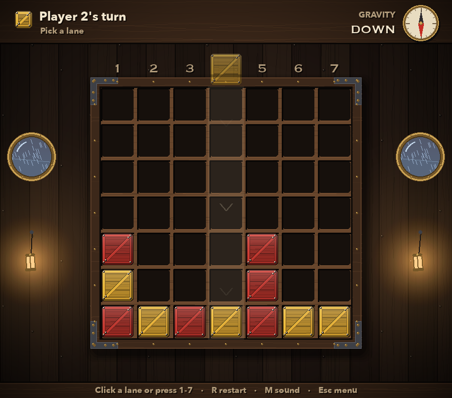<br><sub><b>Choosing a lane.</b> The ghost crate waits at the entry; chevrons show where it will fall.</sub></td>
<td align="center" width="50%">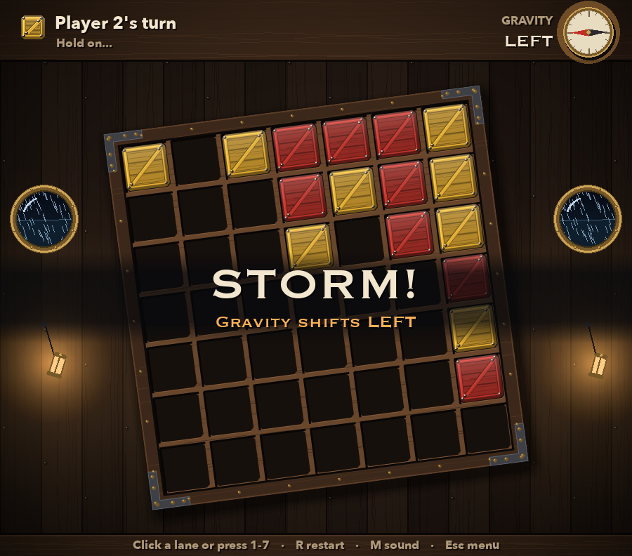<br><sub><b>Storm!</b> The compass spins to a new gravity and the hold rolls with it.</sub></td>
</tr>
<tr>
<td align="center">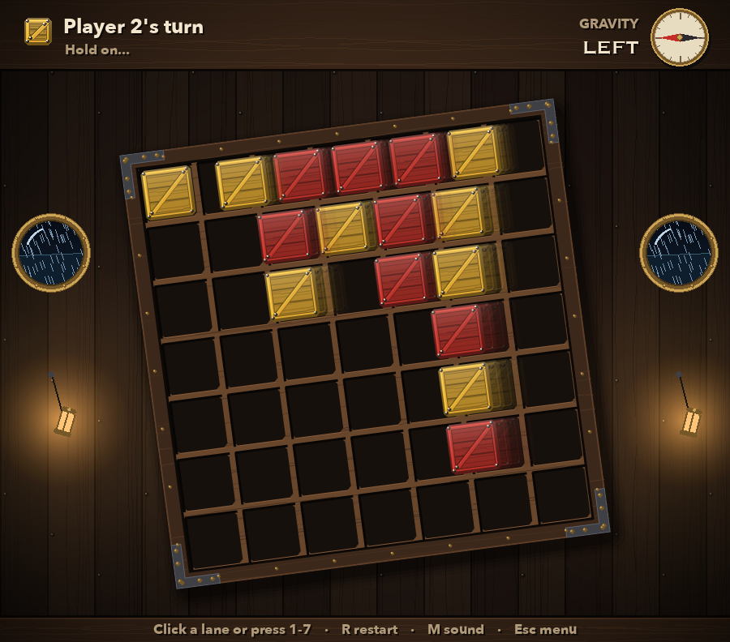<br><sub><b>The cascade.</b> Every crate slides to the new wall, each landing with its own thud.</sub></td>
<td align="center">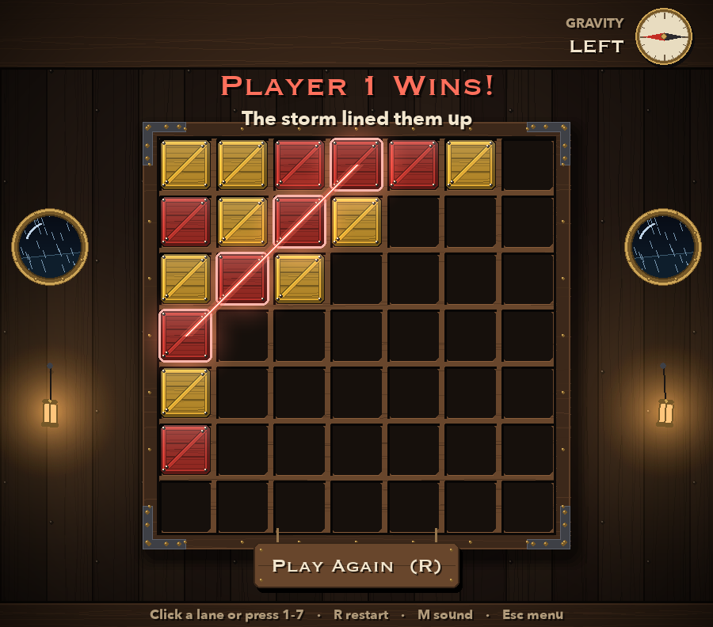<br><sub><b>A storm win.</b> The cascade lined up four for Player 1, who didn't even move last.</sub></td>
</tr>
</table>

---

## 🎮 How to play

### The rules

The complete rulebook is in **[RULES.md](RULES.md)**. In short, every turn goes **play, then storm**:

| Step | What happens |
|---|---|
| **1. Drop** | Pick a lane (1–7). Your crate enters from the wall opposite gravity and lands on the first free cell nearest the gravity wall. A full lane can't be chosen. |
| **2. Drop check** | Four in a row (horizontal, vertical or either diagonal) wins **immediately**. No storm follows. |
| **3. Full check** | A full hold with no four in a row is a **draw**. |
| **4. Storm roll** | 50%: calm, nothing happens. 50%: gravity turns to one of the **3 other** directions, each equally likely. |
| **5. Cascade** | Every crate slides toward the new wall, keeping its order in its lane. |
| **6. Storm check** | If exactly one player now has four in a row, **they win**, even if it wasn't their move. If **both** do, it's a **draw**. |

Lanes are always **parallel to gravity**: columns when gravity is up or down, rows when it's left or right. The lane numbers move to whichever edge crates currently enter from, so "lane 3" always means what's shown on screen.

### Controls

| Input | Action |
|---|---|
| Click a lane, or press **1–7** | Drop a crate |
| **R** | Restart |
| **M** | Sound on / off |
| **Esc** | Back to the menu |

When choosing an opponent: **1–5** picks a level, **F / S / R** picks first, second or random, **Enter** starts.

### Modes

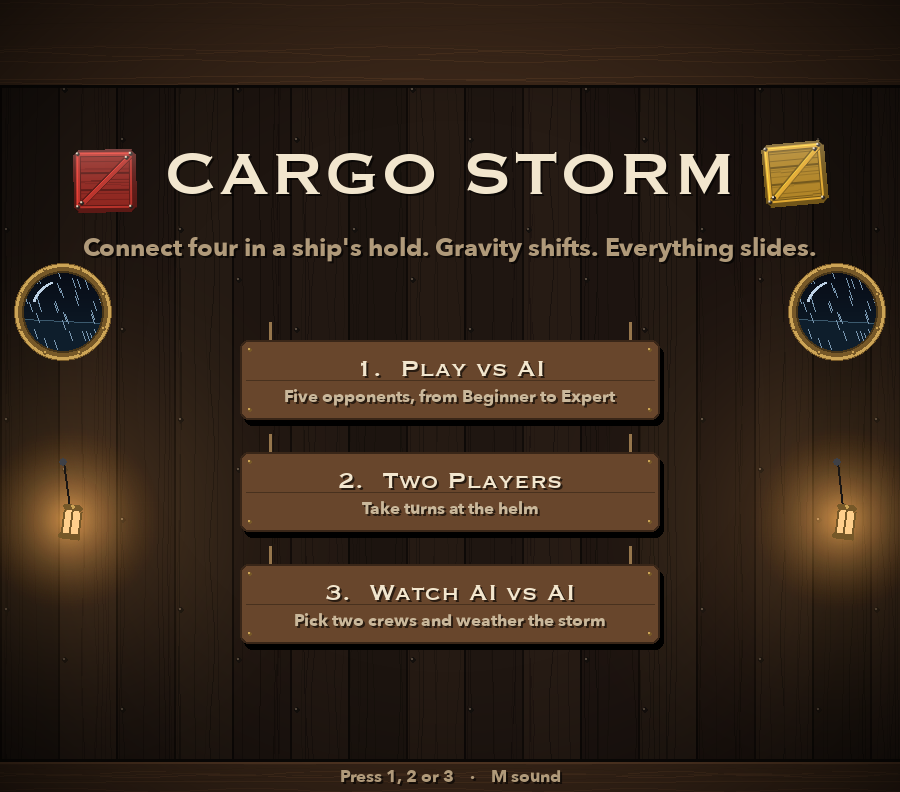

- **Play vs AI**: pick one of **five opponents** and whether you move **first, second or at random**.
- **Two Players**: take turns on one machine.
- **Watch AI vs AI**: pick an AI for each crew and watch them battle it out.

Everything you see and hear is generated in code: the wooden hold, crates, brass compass, swinging lanterns and rain-streaked portholes are drawn procedurally, and every sound effect (wood scraping, the latch clicking shut, thunder, the wave hitting the hull, the ship's bell) is synthesised from numpy waveforms at startup. The game contains no image or audio files.

<br clear="right">

### Opponents

Every opponent is a real agent from the [final tournament](#-results-the-tournament), ranked by its rating there. The three trained networks ship with the game, so all five are playable right after installing.

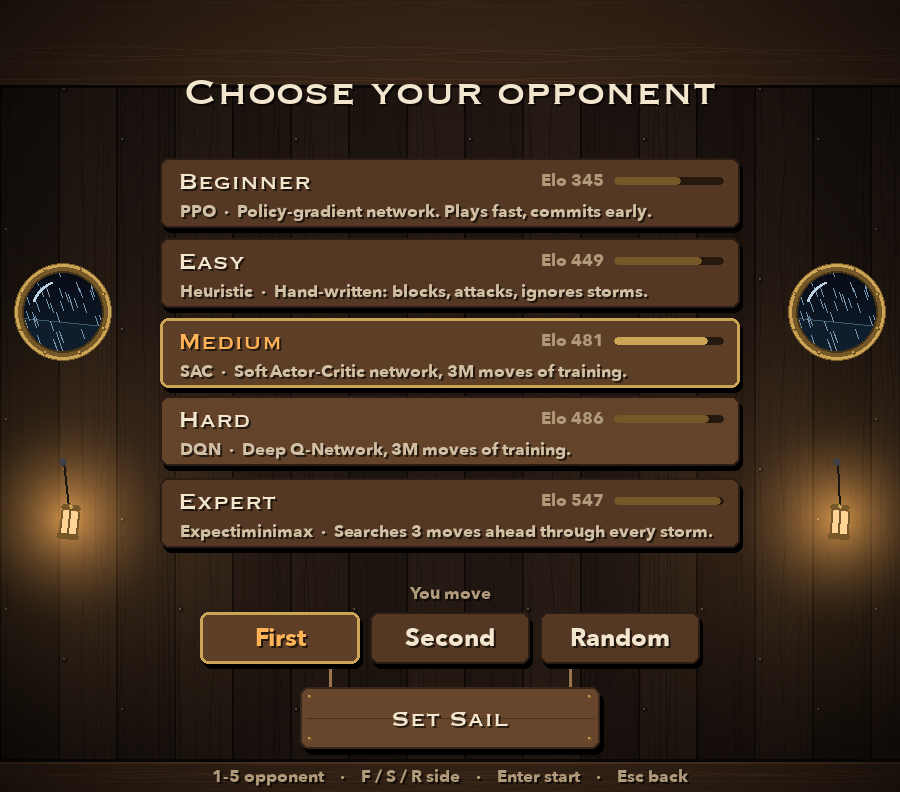

| Level | Opponent | How it plays | Elo |
|---|---|---|--:|
| **Beginner** | PPO | Trained policy network. Plays fast, commits early | 345 |
| **Easy** | Heuristic | Hand-written: wins, blocks, builds threes. Ignores storms | 449 |
| **Medium** | SAC | Soft Actor-Critic network, 3M moves of training | 481 |
| **Hard** | DQN | Deep Q-Network, 3M moves of training | 486 |
| **Expert** | Expectiminimax | Searches 3 moves ahead through every possible storm | 547 |

Choosing your side matters: moving first is a real advantage in this game (see [the findings](#what-we-learned)), so "Second" is the harder challenge at any level.

<br clear="right">

<div align="center">
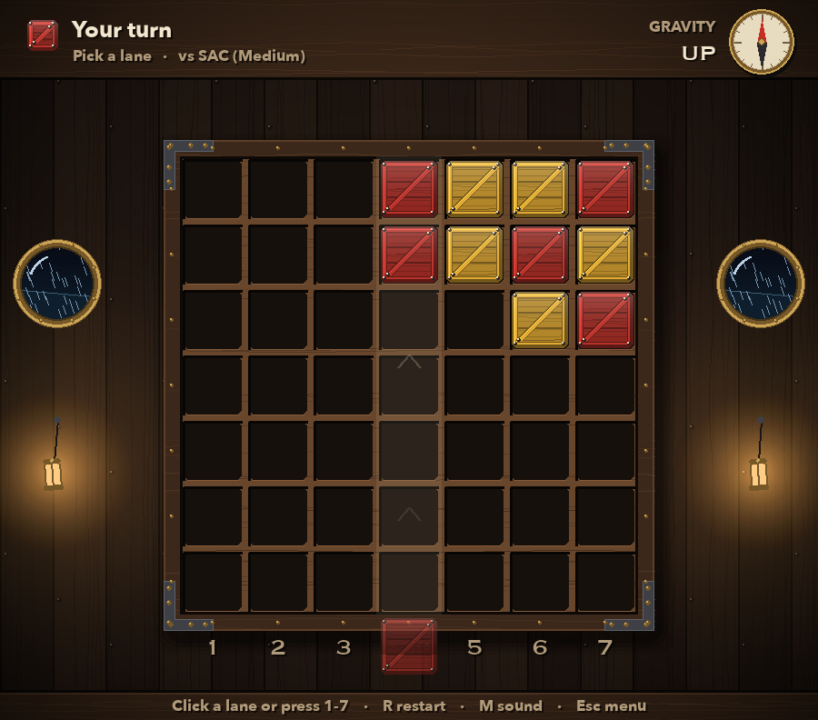<br>
<sub>Playing against <b>SAC (Medium)</b> while gravity points <b>up</b>: crates enter from the bottom and fall upward.</sub>
</div>

---

## 🚀 Quick start

Requires **Python 3.11+**.

```bash
git clone https://github.com/0-Playor-0/cargo-storm.git
cd cargo-storm
python -m venv .venv && source .venv/bin/activate
pip install -e .
python -m cargostorm
```

Once installed, the game is also available as the `cargostorm` command. The trained networks come with it, so there's nothing to train or download before playing.

---

## 🛠 How it's built

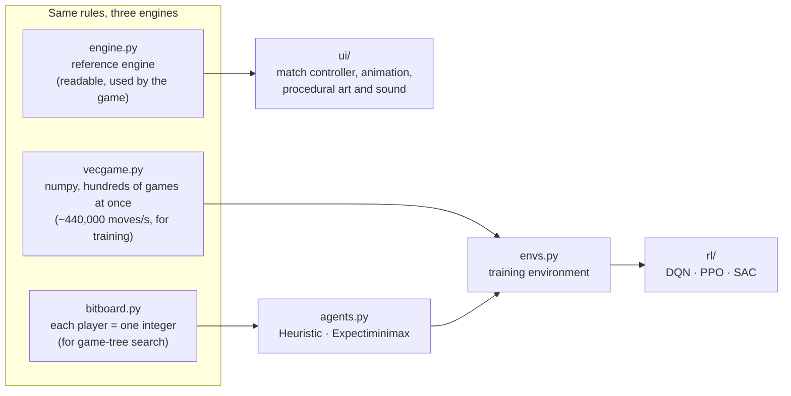

**One rulebook, three engines.** The game uses a clear, readable reference engine. Training needs speed, so a numpy engine plays hundreds of games at once, about **37× faster**. Search needs even more speed per position, so a bitboard engine stores each player's crates as a single integer, where four-in-a-row detection is four shift-and-AND operations. During development all three were checked against each other, move by move, over thousands of games.

**The canonical-frame trick.** Every engine rotates the board so that gravity always points **down** before doing anything. Dropping and cascading are then always the classic "fall to the bottom" case, written once. The AI sees the board the same way, so it never needs to be told which way gravity points, and never has to learn the same pattern separately for each of the four orientations.

**Rules and visuals are separate.** The engine settles a whole turn instantly; the screen then catches up through animation, and input stays locked until it has. The match controller emits events (`drop`, `land`, `storm`, `cascade`, `impact`, `over`) that the sound and visual effects react to, so the game logic knows nothing about pygame.

---

## 🧠 The AI

### What the agents see, do and get

| | |
|---|---|
| **Observation** | A 3 × 7 × 7 tensor: planes for *empty*, *my crates*, *their crates*, always in the canonical frame (gravity down) |
| **Action** | One of 7 columns. Full columns are **masked out**, so illegal moves are never chosen |
| **Reward** | **+1** win, **−1** loss, **0** draw, **0** for every other move. Storm results count fully, even on the opponent's turn |
| **Discount** | γ = 0.99, so faster wins are worth slightly more |
| **Seat** | Random each game, so every agent learns to play both first and second |

There's no reward shaping. A "three in a row" that looks strong under one gravity can be useless after a storm, so the agents learn only from real outcomes.

### The baselines (hand-written, no learning)

| Agent | How it plays |
|---|---|
| **Random** | Any legal move |
| **Heuristic** | Win if possible, block a drop-win, otherwise pick the position with the most open threes and twos. **Ignores storms.** |
| **Expectiminimax-N** | Searches N moves ahead and **averages over the four storm outcomes** (calm ½, each new gravity ⅙) using chance nodes, with Star1 pruning. Depth 3 takes about 86 ms per move |

### The three learners

All three use the **same network trunk** (a residual CNN, 64 channels × 4 blocks, about 337k parameters) and the **same training budget: 3,000,000 moves each**. So the comparison is about the learning method, not the model or the compute.

<table>
<tr><th>DQN (Deep Q-learning)</th><th>PPO (Proximal Policy Optimisation)</th><th>SAC (Soft Actor-Critic, discrete)</th></tr>
<tr valign="top">
<td>Learns the value of every move, Q(s, a), and plays the best one.<br><br>
• <b>Double DQN</b>: one network picks the next move, a slow target network scores it, curbing overestimation that the random storms make worse<br>
• <b>Dueling head</b>: "how good is this position" separate from "how much better is each move"<br>
• <b>3-step returns</b> and a <b>400k-move replay buffer</b><br>
• Exploration: <b>ε-greedy</b>, ε decays 1.0 → 0.05</td>
<td>Learns the policy directly: a probability for each move.<br><br>
• <b>Clipped updates</b>: no move's probability may change by more than about 20% per update<br>
• <b>GAE</b> (λ = 0.95) advantages from a value head<br>
• <b>On-policy</b>: learns from fresh games, then discards them<br>
• Exploration: an <b>entropy bonus</b> that decays 0.02 → 0.005<br>
• Stops an update the moment the policy drifts past a KL limit</td>
<td>Maximises reward <i>plus</i> entropy: win while staying as unpredictable as you can afford.<br><br>
• An actor and <b>two critics</b> (take the minimum to curb overestimation)<br>
• Exact soft values: the sum over all 7 moves, no sampling<br>
• The <b>temperature α tunes itself</b> toward a target entropy that decays from 60% to 20% of the maximum<br>
• Same replay buffer and 3-step returns as DQN</td>
</tr>
</table>

**Mirror augmentation.** Because storms are equally likely to turn gravity clockwise or anticlockwise, a position and its left-right mirror image are exactly as good. Every algorithm trains on both, doubling its data for free.

**Opponents: a small self-play league.** Each training game draws an opponent from Random, Heuristic, or one of 8 frozen past copies of the learner itself (refreshed every 100k moves). Early on it's mostly Random (60%); as training goes on, self-play takes over. Every 250k moves the agent is evaluated over 200 games each against Random, Heuristic and Expectiminimax-1/2, and the best checkpoint is kept.

Training ran on an **Apple M1 MacBook Air (8 GB)** using the Metal GPU backend. Every trainer saves its complete state at each evaluation and can **pause and resume** exactly where it left off.

---

## 🏆 Results: the tournament

After training, every agent played every other in a **round-robin of 28 pairings × 1,000 games**: **28,000 games**, with seats alternating so the first-move advantage cancels out. The results were fitted to an **Elo scale** (Random = 0) with 95% intervals from 200 bootstrap resamples.

> [!IMPORTANT]
> **DQN and SAC tie for best learner** and both clearly beat the hand-written Heuristic bot and depth-1 search. **Neither has caught up with depth-2 or depth-3 search yet.** **PPO finished last of the learners** after its policy hardened too early.

<div align="center">
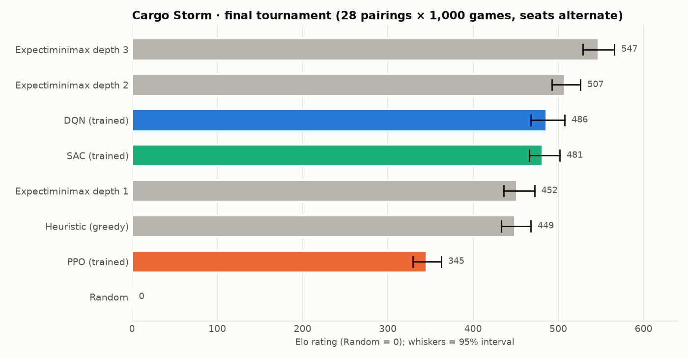
</div>

| | Agent | Type | Elo | 95% interval | |
|:-:|---|---|--:|:-:|---|
| 🥇 | **Expectiminimax-3** | search | **547** | 529 – 566 | `██████████████████████████` |
| 🥈 | **Expectiminimax-2** | search | **507** | 492 – 526 | `████████████████████████` |
| 🥉 | **DQN** | 🧠 learned | **486** | 468 – 508 | `███████████████████████` |
| 4 | **SAC** | 🧠 learned | **481** | 466 – 502 | `███████████████████████` |
| 5 | Expectiminimax-1 | search | 452 | 436 – 472 | `█████████████████████` |
| 6 | Heuristic | hand-written | 449 | 433 – 468 | `█████████████████████` |
| 7 | **PPO** | 🧠 learned | **345** | 329 – 363 | `████████████████` |
| 8 | Random | baseline | 0 | (reference) | |

### Head to head

Each cell is the **row agent's score** against the column agent (win = 1, draw = ½), over 1,000 games.

<div align="center">
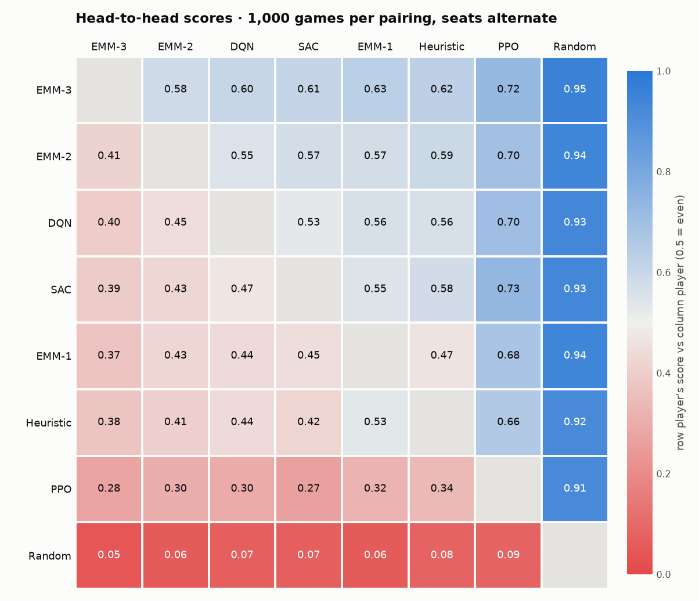
</div>

<details>
<summary><b>Full results for every learned agent (win–draw–loss over 1,000 games)</b></summary>

| | vs DQN | vs SAC | vs PPO | vs Heuristic | vs EMM-1 | vs EMM-2 | vs EMM-3 | vs Random |
|---|:-:|:-:|:-:|:-:|:-:|:-:|:-:|:-:|
| **DQN** | — | 516–23–461 | 691–20–289 | 550–22–428 | 552–18–430 | 431–31–538 | 381–32–587 | 928–8–64 |
| **SAC** | 461–23–516 | — | 722–18–260 | 564–26–410 | 539–16–445 | 409–38–553 | 374–38–588 | 927–6–67 |
| **PPO** | 289–20–691 | 260–18–722 | — | 336–12–652 | 314–18–668 | 291–28–681 | 268–15–717 | 910–9–81 |

</details>

### Learning curves

Score against each fixed opponent during training (greedy play, 200 games per point).

<div align="center">
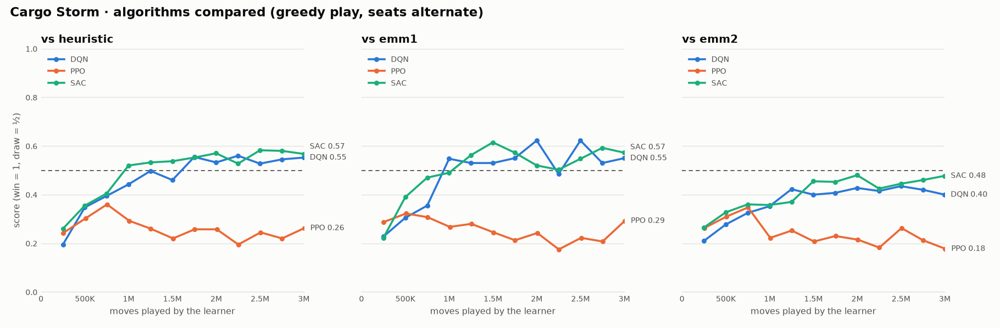
</div>

### What we learned

<table>
<tr valign="top">
<td width="50%">

#### 1. Off-policy beat on-policy
With a fixed, modest budget of moves, **DQN and SAC reuse every game several times** from their replay buffers. PPO learns from each batch once, then throws it away. Combined with sparse, very noisy rewards (a 50% storm every move), that made the off-policy learners far more sample-efficient: **about 140 Elo** ahead of PPO.

</td>
<td width="50%">

#### 2. PPO hardens too early
PPO's policy entropy (how spread out its choices are) fell from 1.95 to about 0.1. A rigid policy is easily exploited by past copies of itself in self-play. Our first PPO run **collapsed outright**; the fixed run (smaller learning rate, a stricter KL stop) peaked at 750k moves, then slowly declined.

| at 750k moves | PPO v1 | PPO v2 |
|---|:-:|:-:|
| score vs EMM-2 | 0.18 | **0.35** |
| KL per update | 0.108 | 0.025 |

</td>
</tr>
<tr valign="top">
<td>

#### 3. Discrete SAC was the surprise
SAC was built for continuous actions and its discrete version is known to be touchy. It was expected to finish last. Instead it **matched DQN**, and its self-tuning temperature held exploration right on target through the second half of training.

</td>
<td>

#### 4. Search still wins, and moving first matters
A storm every other move makes long plans fragile, so **depth 3 beats depth 2 by only ~40 Elo**, but no learner has yet matched depth-2 search. And **moving first is worth a lot**: against comparable opponents, DQN and SAC score about **0.55–0.70 as Player 1** but only **0.24–0.47 as Player 2**.

</td>
</tr>
</table>

> [!NOTE]
> **Caveats, stated honestly.**
> - **The winner's curse.** Each agent's best checkpoint was picked from noisy 200-game evaluations, so training-time scores ran optimistic (SAC's 0.48 against EMM-2 came out at 0.43 over 1,000 games). The tournament numbers are the reliable ones.
> - **Interrupted runs.** DQN and SAC were paused mid-training and warm-started from saved weights (at 1.25M and 0.75M moves), with a fresh replay memory.
> - **Uneven tuning.** PPO got one round of fixes after its first run collapsed; DQN and SAC were run once with their initial settings.

---

## 🏋️ Train your own agents

Each algorithm is one command. Checkpoints, logs and full training state go to `runs/<name>/`.

```bash
python -m cargostorm.rl.dqn --steps 3000000 --name dqn-v1
python -m cargostorm.rl.ppo --steps 3000000 --name ppo-v2
python -m cargostorm.rl.sac --steps 3000000 --name sac-v1
```

- **Pause and resume**: stop any time (Ctrl-C), then continue exactly where you left off with `--resume true`.
- **Every hyperparameter is a flag**, e.g. `--lr 1e-4 --n-envs 128`. Run with `--help` to see them all.
- **Hardware**: Apple GPUs (MPS) and NVIDIA GPUs (CUDA) are used automatically, falling back to CPU.

Training all three side by side on the M1 MacBook Air used here took a few hours.

---

## 📁 Project structure

```
cargo-storm/
├── RULES.md                 the complete rulebook
├── cargostorm/
│   ├── engine.py            reference rules engine (used by the game)
│   ├── vecgame.py           numpy engine: hundreds of games at once, for training
│   ├── bitboard.py          bitboard engine, for game-tree search
│   ├── agents.py            Heuristic and Expectiminimax players
│   ├── models/              the trained DQN, SAC and PPO networks
│   ├── envs.py              the training environment (masking, rewards, opponents)
│   ├── rl/
│   │   ├── nets.py          shared residual CNN: Q-network, actor-critic, actor
│   │   ├── replay.py        replay buffer, n-step returns, mirror augmentation
│   │   ├── dqn.py           Double DQN trainer
│   │   ├── ppo.py           PPO trainer
│   │   ├── sac.py           discrete SAC trainer
│   │   ├── common.py        checkpoints, self-play pool, evaluation, logging
│   │   └── resume.py        full-state save and resume
│   └── ui/
│       ├── app.py           scenes, rendering and input
│       ├── opponents.py     the five difficulty levels
│       ├── match.py         turn sequencing, animation timeline, AI thinking thread
│       ├── theme.py         procedural art: hold, crates, compass, lanterns
│       ├── sound.py         synthesised sound effects
│       ├── fx.py            particles, shockwaves, screen shake
│       ├── tween.py         easing curves and the animation timeline
│       └── layout.py        screen geometry
└── docs/images/             screenshots and charts used in this README
```

---

## 🙏 Acknowledgements

- This README was written with help from **[Claude](https://claude.ai)** (Anthropic).
- The game began as a Connect 4 assignment; Cargo Storm is its re-imagined, storm-tossed successor.

© Ojas Kulkarni. All rights reserved.
